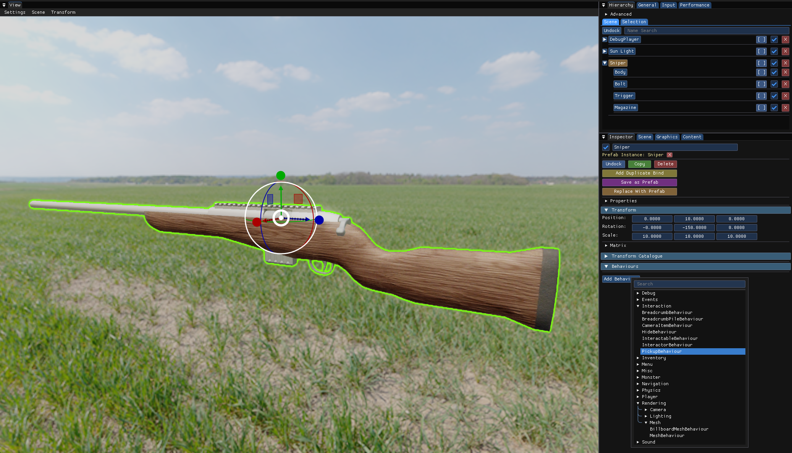
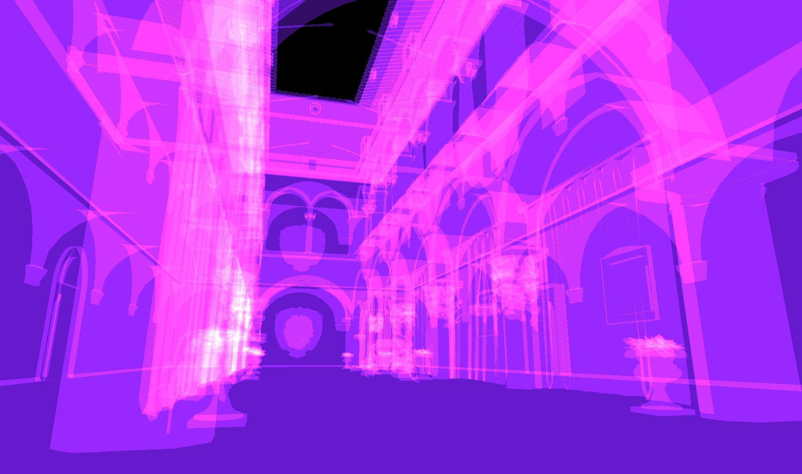

# Well Engine

A D3D11-based 3D game + engine originally developed as a group project by six students for Lurks Below. 

## Usage

Shouldn't require any prerequisites. Only supported platform is Windows.

- Download the repository and open "WellEngine.sln" in Visual Studio (tested with 2022). 
- Ensure "Application" is the selected startup project. 
- The preferred build mode is usually Release. Select Debug if using breakpoints. Select Deploy to build the game with all editor functionality stripped away. 

## Functionality

### Entities & Behaviours

- Similar to Unity's GameObjects & Components 

### Scenes

- Quad-tree based frustum culling
- Serialization
- Prefabs

### Dev Tools

- Transformation controls
- Entity creation
- Simple debug shape drawing
- Full [Tracy](https://github.com/wolfpld/tracy) support
- Runtime resource loading & shader compilation

### Multi-pass Rendering

- Shadowmapping
- Metallic reflections
- Environment maps
- Tiled forward rendering
	- Transparency pass
- Post-processing
	- Volumetric fog
	- Bloom
 	- Depth of Field

## Libraries

- [Dear Imgui](https://github.com/ocornut/imgui) for UI
- [Jolt Physics](https://github.com/jrouwe/JoltPhysics) for collision & physics
- [ImPlot](https://github.com/epezent/implot) for prettier plotting UI
- [ImGuizmo](https://github.com/CedricGuillemet/ImGuizmo) for transformation tools
- [SDL3](https://github.com/libsdl-org/sdlwiki/tree/main/SDL3) for window handling
- [Tracy](https://github.com/wolfpld/tracy) for frame capture
- [DirectXTex](https://github.com/microsoft/DirectXTex) for texture loading, manipulation & block compression
- [Magick++](https://github.com/ImageMagick/ImageMagick/tree/main/Magick%2B%2B) for texture creation & manipulation
- [stb](https://github.com/nothings/stb) for texture loading
