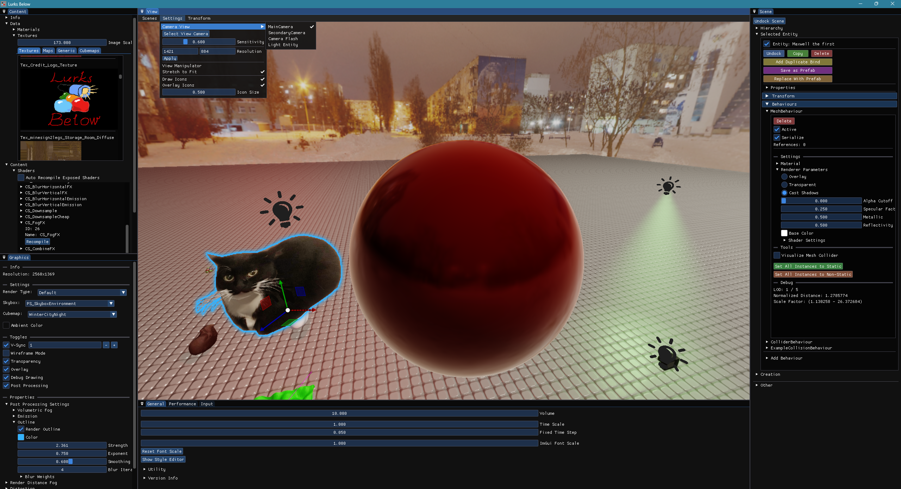

# Well Engine

A D3D11-based 3D game + engine originally developed as a group project by six students for Lurks Below. 

[Gameplay & Feature Showcase](https://www.youtube.com/watch?v=1Gf-hLuPSCU)

## Functionality

### Entities & Behaviours

- Similar to Unity's GameObjects & Components 

### Scenes

- Quad-tree based frustum culling
- Serialization
- Prefabs

### Dev Tools

- Transformation controls
- Entity creation
- Simple debug shape drawing
- Full [Tracy](https://github.com/wolfpld/tracy) support
- Runtime resource loading & shader compilation

### Multi-pass Rendering

- Shadowmapping
- Metallic reflections
- Environment maps
- Tiled forward rendering
	- Transparency pass
- Post-processing
	- Volumetric fog
	- Bloom

## Libraries

- [Dear Imgui](https://github.com/ocornut/imgui) for UI
- [SDL3](https://github.com/libsdl-org/sdlwiki/tree/main/SDL3) for window handling
- [Tracy](https://github.com/wolfpld/tracy) for frame capture
- [DirectXTex](https://github.com/microsoft/DirectXTex) for texture loading, manipulation & block compression
- [stb](https://github.com/nothings/stb) for texture loading
- [ImGuizmo](https://github.com/CedricGuillemet/ImGuizmo) for transformation tools
